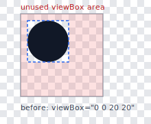
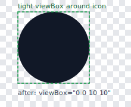

# svgo-autocrop

SVGO plugin that cleans up mismatched third-party SVG icon packs. If your icons come from mixed sources and render differently, this plugin helps you keep framing, sizing, and color behavior consistent.

### Example

Conceptual before/after illustration (Markdown table + local SVGs, so it renders on both GitHub and JSR):

| Before                                                   | After                                                    |
| -------------------------------------------------------- | -------------------------------------------------------- |
|  |  |

**Input**

```svg
<svg viewBox="0 0 20 20" xmlns="http://www.w3.org/2000/svg">
   <circle cx="5" cy="5" r="5" fill="#000"/>
</svg>
```

**Output**

```svg
<svg viewBox="0 0 10 10" xmlns="http://www.w3.org/2000/svg">
   <circle cx="5" cy="5" r="5" fill="#000"/>
</svg>
```

**Output with `{ setColor: 'currentColor' }`**

```svg
<svg viewBox="0 0 10 10" xmlns="http://www.w3.org/2000/svg">
   <circle cx="5" cy="5" r="5" fill="currentColor"/>
</svg>
```

## Quick Start

```terminaloutput
pnpm add -D svgo svgo-autocrop
```

Then run SVGO:

```terminaloutput
svgo --input 'input.svg' --output 'output.svg'
```

Or with an explicit config:

```terminaloutput
svgo --input 'input.svg' --output 'output.svg' --config 'svgo.config.mjs'
```

Recommended usage pattern is shown in [svgo.config.mjs](svgo.config.mjs):

- `preset-default` enabled
- `multipass: true`
- this plugin near the end, after baseline shape/color simplifications

### Practical presets

1. Tight crop only (safe default for most icons):
    ```yaml
    {}
    ```
2. Crop + clean noisy metadata:
    ```yaml
    {
        includeWidthAndHeightAttributes: false,
        removeClass: true,
        removeStyle: true,
        removeDeprecated: true,
    }
    ```
3. Monochrome UI icons:
    ```yaml
    {
        includeWidthAndHeightAttributes: false,
        removeClass: true,
        removeStyle: true,
        removeDeprecated: true,
        setColor: 'currentColor',
        setColorIssue: 'fail',
    }
    ```

## Parameters

| Parameter                                             | Default     | Recommended                                    | Description                                                                                                                                                                                                                                        |
| ----------------------------------------------------- | ----------- | ---------------------------------------------- | -------------------------------------------------------------------------------------------------------------------------------------------------------------------------------------------------------------------------------------------------- |
| autocrop                                              | `true`      | `true`                                         | Enables auto-cropping. Set `false` to skip viewBox tightening while still allowing other enabled transforms.                                                                                                                                       |
| <sub><sup>includeWidthAndHeightAttributes</sup></sub> | `undefined` | `false`                                        | Controls root `<svg>` `width`/`height` handling: `false` removes both, `true` writes both from the final viewBox, `undefined` (default) only writes them when the input already had dimensions.                                                    |
| padding                                               | `undefined` | `undefined`                                    | Adds extra space after autocrop. Accepts a number, an object `{ top, bottom, left, right }`, or a function `(viewboxNew, viewbox, ast, params, info)` that mutates `viewboxNew`. Padding is usually better handled in CSS than baked into the SVG. |
| removeClass                                           | `false`     | `true` (typically can be safely set to `true`) | Removes all `class` attributes when enabled.                                                                                                                                                                                                       |
| removeStyle                                           | `false`     | `true` (typically can be safely set to `true`) | Removes inline styling noise when enabled: `style`, `font-family`, and empty/`visible` `overflow` attributes.                                                                                                                                      |
| removeDeprecated                                      | `false`     | `true`                                         | Removes deprecated and exporter-specific metadata when enabled (for example `version`, `baseProfile`, `enable-background`, `data-name`, `xml:space`, `xmlns:sketch`, and `sketch:*`).                                                              |
| setColor                                              | `undefined` | `'currentColor'`                               | Replaces paint colors with the specified value (usually `'currentColor'`).                                                                                                                                                                         |
| setColorIssue                                         | `'warn'`    | `'warn'` or `'fail'`                           | Behavior when `setColor` is active and multiple colors are found: `'warn'` logs a warning, `'fail'` throws, `'rollback'` undoes recoloring, `'ignore'` forces recoloring without warning/error.                                                    |
| disableTranslate                                      | `false`     | `false`                                        | Disables translating geometry back to `(0, 0)` when enabled.                                                                                                                                                                                       |
| disableTranslateWarning                               | `true`      | `true`                                         | Suppresses warnings when translation cannot be applied.                                                                                                                                                                                            |

## Why this fork

This project began as a fork of [glennosss/svgo-autocrop](https://github.com/glennosss/svgo-autocrop), but the core has changed a lot. Cropping now runs in-process with [@resvg/resvg-js](https://github.com/thx/resvg-js), so there is no Puppeteer startup or worker-thread overhead, and batch icon processing is faster. The codebase also moved to TypeScript + SVGO v4. The transform flow is safer too: if one step hits an unsupported case, that step can roll back while the other successful transforms stay in place.
