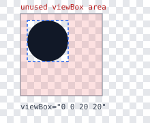
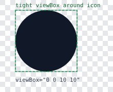
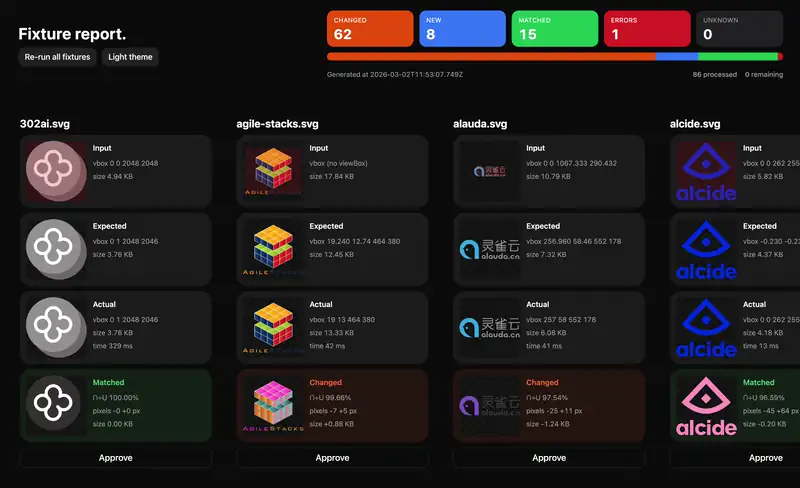

# svgo-autocrop [](https://jsr.io/@strebz/svgo-autocrop)

SVGO plugin for making mixed-source SVGs render consistently. It tightens the viewBox, aligns geometry, unifies colors, and removes noise. Great for icon-packs.

### Example

| Before                                                   | After                                                    |
| -------------------------------------------------------- | -------------------------------------------------------- |
|  |  |

**Input**

```svg
<svg viewBox="0 0 20 20" xmlns="http://www.w3.org/2000/svg">
    <circle cx="5" cy="5" r="5" fill="#000"/>
</svg>
```

**Output**

```svg
<svg viewBox="0 0 10 10" xmlns="http://www.w3.org/2000/svg">
    <circle cx="5" cy="5" r="5" fill="currentColor"/>
</svg>
```

## Motivation

There is an existing tool, [cncf/svg-autocrop](https://github.com/cncf/svg-autocrop), built by CNCF in 2019 for rendering thousands of company logos on their website. It was designed for a specific internal use case and is intentionally opinionated. Later, [glennosss/svgo-autocrop](https://github.com/glennosss/svgo-autocrop) adapted the idea into a configurable SVGO v2 plugin.

This project started as a fork and is intended to be a modern drop-in replacement. The public interface is preserved, while the implementation was rewritten in TypeScript and targets SVGO v4. Cropping runs in-process via [@resvg/resvg-js](https://github.com/thx/resvg-js) and typically completes in about 10ms per image, making it fast enough for large icon pipelines. The package has only three runtime dependencies and no longer ships a bundled browser.

I wanted this plugin to be easy to use and safe by default. Transformations follow the best-effort principle: if a step cannot be applied, it rolls back and the rest of the pipeline continues. I also covered the implementation with unit tests and added a visual regression tool to catch rendering issues. This reduces the chance of the optimizer silently breaking your SVGs.

## Quick Start

```terminaloutput
pnpm i jsr:@strebz/svgo-autocrop
```

Then run SVGO from the code:

```javascript
import { optimize } from 'svgo';
import autocrop, { paramsToBeMonochrome } from 'svgo-autocrop';

const result = optimize('<svg>...</svg>', {
    plugins: [{ name: 'preset-default' }, { ...autocrop, params: paramsToBeMonochrome }],
});
```

Or run SVGO binary with an explicit [config](svgo.config.mjs):

```shell
svgo --input 'input.svg' --output 'output.svg' --config 'svgo.config.mjs'
```

## Configuration

<details><summary><b>autocrop</b> — enables auto-cropping.</summary><br/>

When exported SVGs often include accidental empty margins. Tightening the `viewBox` improves icon alignment, prevents layout surprises in UI, and removes manual cleanup from asset pipelines.

The plugin renders each `<svg>` (via `@resvg/resvg-js`), scans RGBA pixels, and finds the smallest rectangle that contains all non-transparent pixels. That rectangle becomes the new `viewBox`.

Cropping runs on the first SVGO pass only, then optional `padding` is applied, and coordinates are translated so content starts at `(0, 0)`.

Cropping assumes a transparent background; nonstandard backgrounds may require a custom predicate (see `getVisiblePixelBounds`). You may either make a pull request, or pass a function in the `padding` parameter to recompute the viewBox.

<br/>
</details>

<details><summary><b>padding</b> — adds extra space after cropping.</summary><br/>

Accepts a number, an object, or a function. Check [AutocropUtils.ts](lib/AutocropUtils.ts) to see how it works.

⚠️ Prefer setting the padding via CSS rules.

<br/>
</details>

<details><summary><b>includeWidthAndHeightAttributes</b> — controls root `width` & `height` attributes.</summary><br/>

- `false` removes both
- `true` writes both from the final viewBox
- `undefined` only writes them when the input already had dimensions

<br/>
</details>

<details><summary><b>setColor</b> — normalizes arbitrary SVGs into "icon-friendly" monochrome assets.</summary><br/>

Many SVG icons are shipped with hard-coded paint values (`#000`, `black`, etc.) and inconsistent use of paint attributes (`fill`, `stroke`, gradients, stops). For UI icon systems, the common goal is a single themeable color (typically`currentColor`) so the same SVG can be tinted via CSS without per-asset edits.

This parameter enforces that constraint and, importantly, prevents silent foot-guns: if the input is actually multicolor artwork, `onColorIssue` decides whether to warn, fail, rollback the broader transform step, or forcibly flatten anyway.

It also makes output deterministic for inputs that rely on SVG "initial" paint defaults (no explicit color attributes). In that case, the root `<svg>` gets a `fill` so the result is explicitly themeable instead of implicitly "black".

⚠️ Depends on the internal plugin [`convertColors`](https://svgo.dev/docs/plugins/convertColors/)

<br/>
</details>

<details><summary><b>setColorIssue</b> — controls what happens when setColor is set and multiple colors are found.</summary><br/>

- `rollback`: undos recoloring
- `warn`: same with a warning
- `fail`: throws an error and stop processing
- `ignore`: forces recoloring

<br/>
</details>

<details><summary><b>removeStyle</b> — strips noisy styling to make SVG icons deterministic and themeable.</summary><br/>

Many editors export vector graphics with inline `style`, `font-family`, and redundant `overflow="visible"` declarations. If those styles are then converted into attributes, it leads to bloated output, noisy diffs, and can fight downstream theming (for example when recoloring to `currentColor` and styling via CSS).

⚠️ Prefer using [`inlineStyles`](https://svgo.dev/docs/plugins/inlineStyles) `{ onlyMatchedOnce: false }` and [`convertStyleToAttrs`](https://svgo.dev/docs/plugins/convertStyleToAttrs) internal plugins.

<br/>
</details>

<details><summary><b>removeClass</b> — removes all `class` attributes when enabled.</summary><br/>

Icon packs often embed pack-specific class names (`bi bi-...`, `icon-...`) that are useful in an HTML sprite workflow, but become baggage in a raw SVG asset pipeline. Keeping these classes makes output noisy, less deterministic, and can unexpectedly couple icons to host-page CSS selectors.

This utility strips that metadata so produced SVGs remain self-contained and behave consistently regardless of where they are embedded. It was developed only because the internal plugin `removeUnknownsAndDefaults` doesn't remove the class attributes at typical elements like `rect`, `path`, `svg`.

⚠️ Prefer using [`inlineStyles`](https://svgo.dev/docs/plugins/inlineStyles) `{ onlyMatchedOnce: false }` and [`convertStyleToAttrs`](https://svgo.dev/docs/plugins/convertStyleToAttrs) internal plugins.

<br/>
</details>

<details><summary><b>removeDeprecated</b> — removes deprecated attributes.</summary><br/>

Icon assets collected from multiple sources often carry attributes that came from older SVG specs, design tools, or editor-specific namespaces. These fields usually add byte size and diff noise, and they make normalized icon output less deterministic across providers without providing value in a modern browser/UI workflow.

This pass strips those historical artifacts so output focuses on actual geometry and paint semantics rather than source-tool fingerprints.

⚠️ Prefer using [`removeDeprecatedAttrs`](https://svgo.dev/docs/plugins/removeDeprecatedAttrs) `{ removeAny: true }` and [`removeUnknownsAndDefaults`](https://svgo.dev/docs/plugins/removeUnknownsAndDefaults) `{ keepDataAttrs: false }` internal plugins.

<br/>
</details>

### Practical presets

##### `paramsToBeSafe`

Safe preset, just cropping SVGs. Changes only the `viewBox` attribute, keeping the rest of the SVG untouched to minimize visual risk.

##### `paramsToBeOptimized`

Preferred preset for optimizing SVGs. Crops and cleans output while preserving original colors and paint attributes. Better use with the [config](svgo.config.mjs).

##### `paramsToBeMonochrome`

Preset tuned for icon packs: crops and normalizes SVGs to monochrome. Uses `currentColor` so icons automatically adapt to light and dark themes.

## Notes & limitations

- `<text>` uses system fonts; custom fonts aren't currently supported.

- Translation is usually helpful, but may occasionally increase file size. For example, when converting relative commands to absolute. Rescaling approach could theoretically solve this problem (see SVGO issues [#791](https://github.com/svg/svgo/issues/791) and [#1270](https://github.com/svg/svgo/issues/1270)).

- To recalculate bounds from the full drawing area, first run SVGO with `removeViewBox` and `removeDimensions`, then run this plugin to compute fresh `viewBox`, `width`, and `height`.

- SVGO presets [can break SVGs](https://github.com/svg/svgo/issues?q=type%3A%22Bug%22%20state%3Aopen)—use the visual regression tool to verify output. Put your SVGs into `fixtures/`, run `pnpm run report:visual`, review the report in your browser. If something looks off, adjust `svgo.config.mjs` and regenerate until the output is stable.<br><br>
